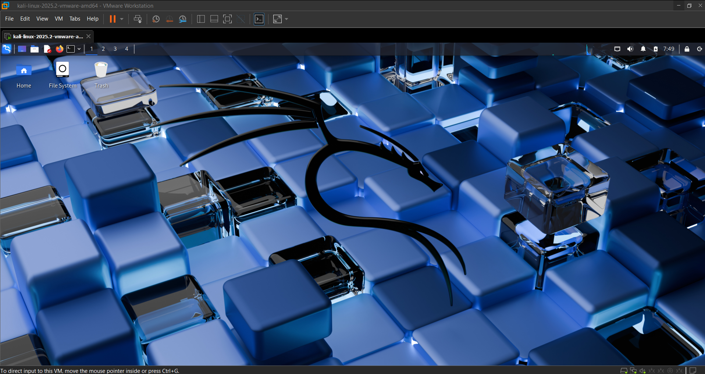
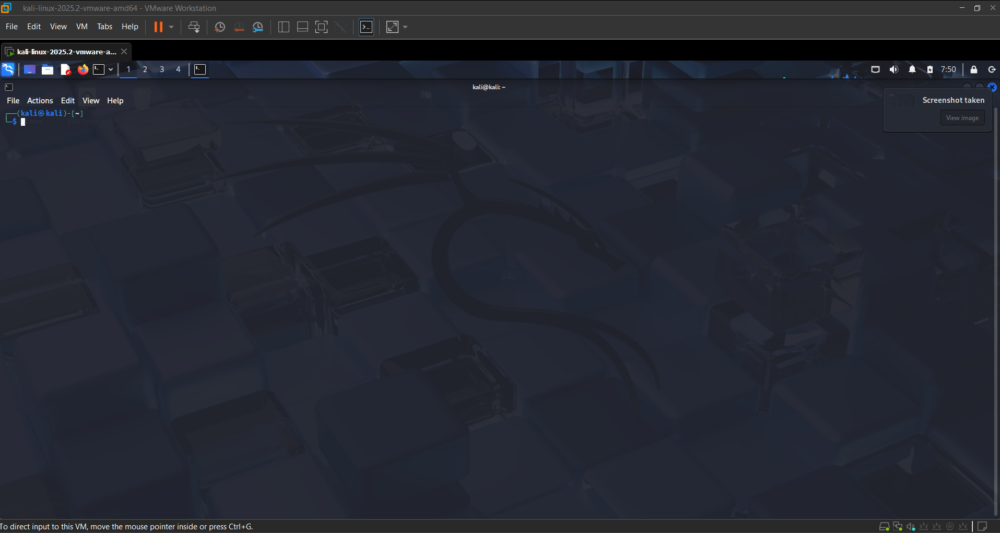
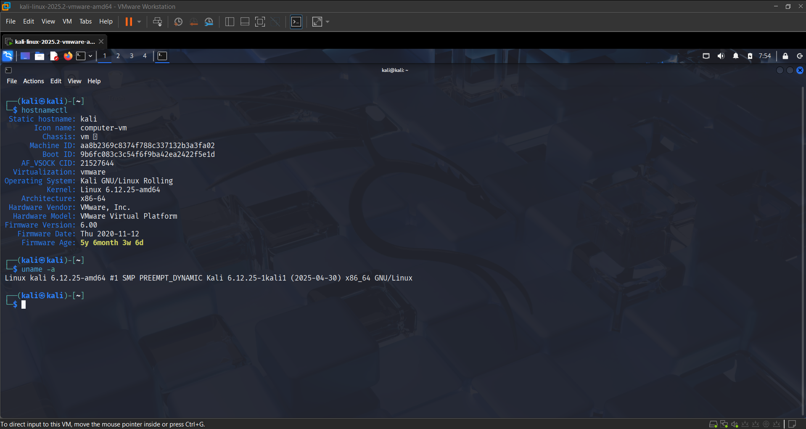
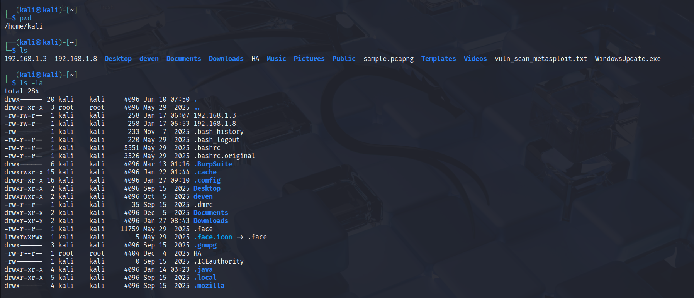
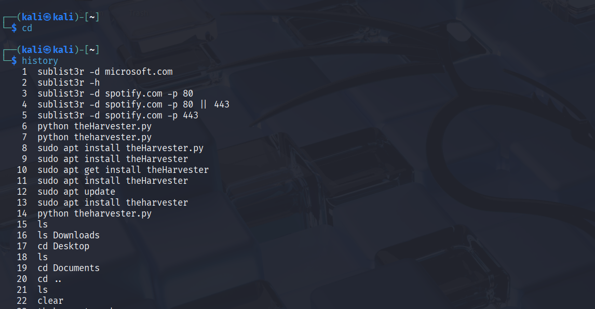
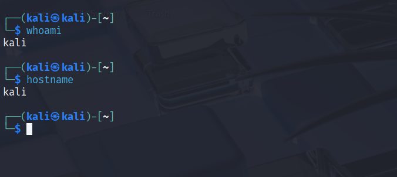
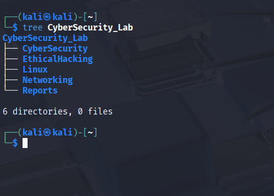
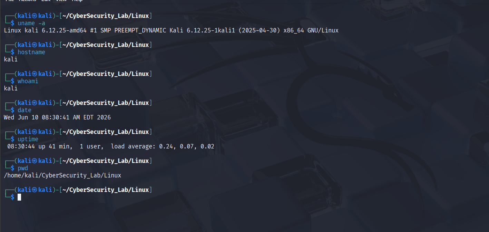

# Linux Task 01: Linux Environment Setup & Essential Commands

## Part A: Linux Installation & Verification

Linux was successfully installed and verified using various Linux commands.
<<<<<<< HEAD


=======



>>>>>>> 4c32db1 (update)

---

## Part B: Basic Navigation Commands

### 1. pwd
It prints the present working directory i.e. the directory in which we are currently working or using.

### 2. ls
It lists all the contents i.e. files and directories present in the current working directory.

### 3. ls -la
It lists all the files and directories including hidden files or directories as well and gives us detailed information of each file and directory.

### 4. cd
It changes the current working directory to another directory.

**Example:**
```bash
cd dir_name
```

### 5. clear
It clears all the contents present on the terminal.

### 6. history
It keeps track of the commands that we have executed in the terminal.

### 7. whoami
It prints the username associated with the current effective user ID. It tells you exactly which user account is executing commands in your current terminal session.

### 8. hostname
It is a built-in networking utility used to view or temporarily change a computer's network identification name.




---

## Part C: Directory Management

### Create Directory



```bash
mkdir CyberSecurity_Lab
mkdir Linux
```

### Change Directory

```bash
cd CyberSecurity_Lab
cd Linux
```

### Remove Directory

```bash
rmdir TestDirectory
```

### Purpose of Commands

- **mkdir** - Used to create a new directory.
- **cd** - Used to change the current working directory.
- **rmdir** - Used to remove an empty directory.

---

## Part D: File Management

### 1. Create Files

```bash
touch notes.txt
touch commands.txt
touch report.txt
```

### 2. Copy Files

```bash
cp report.txt CyberSecurity
```

### 3. Move Files

```bash
mv command.txt Linux/
```

### 4. Rename Files

```bash
mv command.txt command_linux.txt
```

### 5. Delete Files

```bash
rm command.txt
```

### What Each Command Does

#### 1. touch
It is used to create a file in the directory or in the system.

#### 2. cp
It is used to copy the file or directory from one place to another place.

#### 3. mv
It is used to move a file or directory from one place to another place. It can also be used to rename files.

#### 4. rm
It is used to delete files and directories from the system.

---

## Part E: System Information Collection

### Record

**1. Kernel Version:** Kali 6.12.25-1kali1

**2. Username:** kali

**3. Current Directory:** /home/kali/CyberSecurity_Lab/Linux

**4. Current Date and Time:** Wed Jun 10 08:30:41 AM EDT 2026

**5. System Uptime:** 08:30:44 up 41 min, 1 user, load average: 0.24, 0.07, 0.02


---

## Part F: Linux Research Activity

### 1. What is Linux?

Linux is a free and open-source operating system kernel created by Linus Torvalds in 1991. An operating system manages computer hardware and software resources and provides services for computer programs. Because Linux is open source, users can view, modify, and distribute its source code.

### 2. Why is Linux Important in Cyber Security?

Linux plays a crucial role in cyber security because:

- Open Source: Security professionals can inspect and audit the source code.
- Powerful Command Line: Enables efficient system administration and security testing.
- Stability: Linux systems are reliable and less prone to crashes.
- Security Features: Includes strong permission management and access controls.
- Networking Tools: Provides advanced networking and monitoring capabilities.
- Security Distributions: Specialized distributions such as Kali Linux come preloaded with penetration testing tools.

Many servers, cloud platforms, and security appliances run Linux, making it essential for cybersecurity professionals.

### 3. Difference Between Linux and Windows

| Feature | Linux | Windows |
|----------|--------|----------|
| Cost | Free and Open Source | Commercial and Licensed |
| Source Code | Available to everyone | Proprietary |
| Security | Generally more secure and customizable | More frequently targeted by malware |
| User Interface | Command Line and GUI available | Primarily GUI-based |
| Performance | Efficient on low-end hardware | Requires more system resources |
| Software Installation | Package Managers (APT, YUM, etc.) | Executable Installers (.exe, .msi) |
| Customization | Highly Customizable | Limited |
| Usage | Servers, Security, Development | Personal and Business Computing |

### 4. What is a Linux Distribution?

A Linux Distribution (Distro) is a complete operating system built around the Linux kernel along with system utilities, software packages, and graphical interfaces.

Examples of popular Linux distributions include:

- Ubuntu
- Debian
- Fedora
- Kali Linux
- Linux Mint

Different distributions are designed for different purposes such as desktop use, servers, software development, or cybersecurity.

### 5. Why Do Ethical Hackers Prefer Linux-Based Operating Systems?

Ethical hackers prefer Linux because:

- Pre-installed Security Tools
- Powerful Terminal
- Open Source Environment
- Better Networking Support
- Automation
- Stability and Performance
- Industry Standard

Linux provides flexibility, security, and powerful tools that make it the preferred operating system for ethical hacking and penetration testing.

---

## Conclusion

This task covered Linux installation and verification, basic navigation commands, directory management, file management, system information collection, and Linux fundamentals. Understanding these concepts is essential for cybersecurity, ethical hacking, and system administration.
