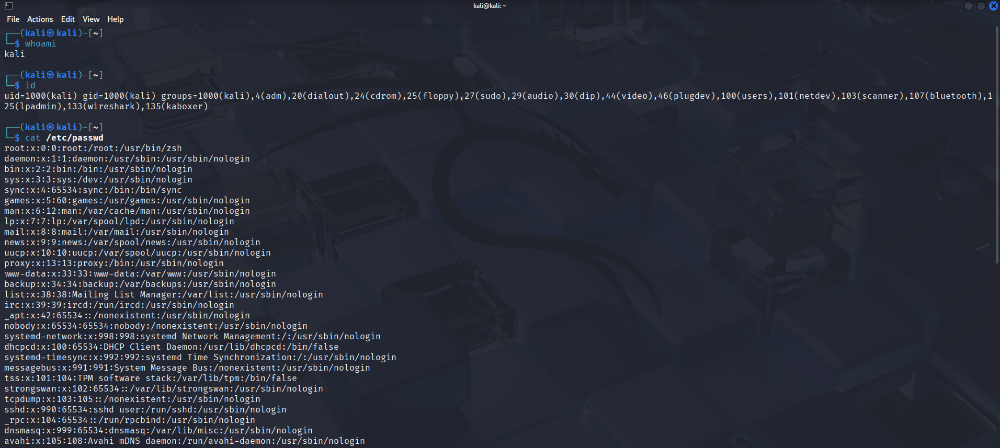
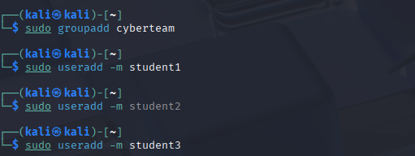
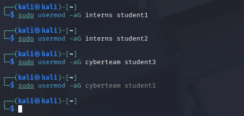
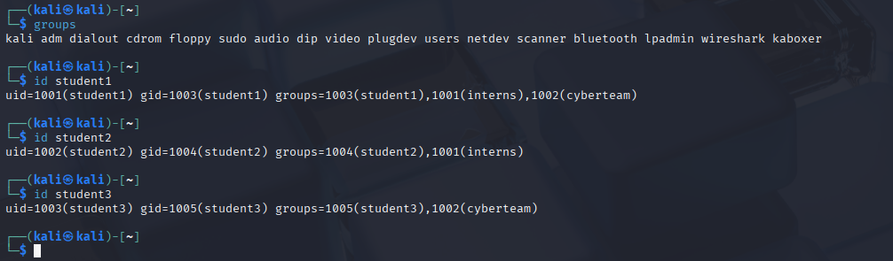
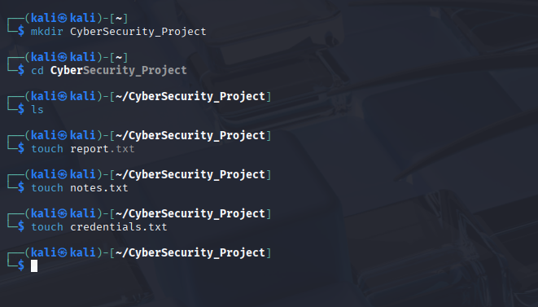
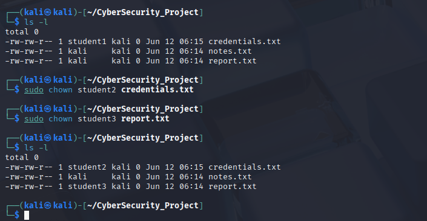
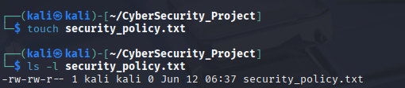
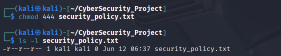
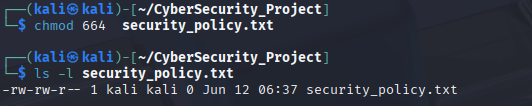
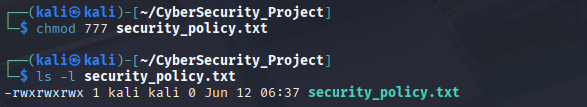

# Linux Task 02: Users, Groups & File Permissions

## Intern Details

- **Name:** Deven Sonawane
- **Task:** Linux Task 02
- **Topic:** Users, Groups & File Permissions

---

# Part A: Understanding Users

### 1. What is your current username?

**Answer:** `kali`

### 2. What is UID?

**Answer:** `UID = 1000`

### 3. What is GID?

**Answer:** `GID = 1000`

### 4. What information does `/etc/passwd` contain?

**Answer:**

The `/etc/passwd` file stores information about user accounts on the system. Each line represents one user and contains seven fields separated by colons (`:`).

---

# Part B: Create Users & Groups

## Create Groups

```bash
sudo groupadd interns
sudo groupadd cyberteam
```

## Create Users

```bash
sudo useradd -m student1
sudo useradd -m student2
sudo useradd -m student3
```


## Add Users to Groups

```bash
sudo usermod -aG interns student1
sudo usermod -aG interns student2
sudo usermod -aG cyberteam student3
sudo usermod -aG cyberteam student1
```

## Verify Group Membership

### groups

```bash
groups
```

**Output:**

```text
kali adm dialout cdrom floppy sudo audio dip video plugdev users netdev scanner bluetooth lpadmin wireshark kaboxer
```

### id student1

```bash
id student1
```

**Output:**

```text
uid=1001(student1) gid=1003(student1) groups=1003(student1),1001(interns),1002(cyberteam)
```

### id student2

```bash
id student2
```

**Output:**

```text
uid=1002(student2) gid=1004(student2) groups=1004(student2),1001(interns)
```

### id student3

```bash
id student3
```

**Output:**

```text
uid=1003(student3) gid=1005(student3) groups=1005(student3),1002(cyberteam)
```

---

# Part C: File Ownership

## Create Project Directory

```bash
mkdir CyberSecurity_Project
```

## Create Files

```bash
cd CyberSecurity_Project

touch report.txt
touch notes.txt
touch credentials.txt
```

## Check Ownership

```bash
ls -l
```

## Change Ownership

```bash
sudo chown student2 credentials.txt
```

### Ownership Details

| Item | Value |
|--------|--------|
| Original Owner | kali |
| New Owner | student2 |
| Command Used | sudo chown student2 credentials.txt |


---

# Part D: File Permissions

## Create File

```bash
touch security_policy.txt
```


## Read Only Permission

```bash
chmod 444 security_policy.txt
```

**Permission:** `r--r--r--`


## Read & Write Permission

```bash
chmod 664 security_policy.txt
```

**Permission:** `rw-rw-r--`


## Full Access Permission

```bash
chmod 777 security_policy.txt
```

**Permission:** `rwxrwxrwx`

---

# Part E: Permission Analysis

| Permission | Symbolic | Owner Rights | Group Rights | Others Rights | Use Case |
|------------|-----------|-------------|-------------|--------------|----------|
| 755 | rwxr-xr-x | Read, Write, Execute | Read, Execute | Read, Execute | Scripts, web applications |
| 644 | rw-r--r-- | Read, Write | Read | Read | Documents, configuration files |
| 777 | rwxrwxrwx | Full Access | Full Access | Full Access | Temporary shared files |
| 600 | rw------- | Read, Write | No Access | No Access | Passwords, private keys |
| 700 | rwx------ | Read, Write, Execute | No Access | No Access | Private scripts, folders |

---

# Part F: Security Challenge

| File | Recommended Permission | Reason |
|--------|----------------------|---------|
| password_backup.txt | 600 (rw-------) | Contains sensitive password information. Only the owner should access it. |
| public_notice.txt | 644 (rw-r--r--) | Everyone can read the notice, but only the owner can modify it. |
| system_log.txt | 640 (rw-r-----) | System logs may contain important information. Group members can read, others cannot. |
| personal_notes.txt | 600 (rw-------) | Personal notes should remain private to the owner. |

---

# Part G: Linux Security Research

## 1. Why are file permissions important?

File permissions are important because they control who can read, write, and execute files and directories in a Linux system. They help protect sensitive information from unauthorized access and prevent unwanted modifications to important files.

---

## 2. What happens if sensitive files are given 777 permissions?

Permission `777` gives full access to everyone. Any user can read, modify, delete, or execute the file, which creates serious security risks and may expose confidential information.

---

## 3. What is the Principle of Least Privilege?

The Principle of Least Privilege (PoLP) states that users, applications, and processes should only be given the minimum permissions necessary to perform their tasks.

---

## 4. Why do organizations restrict user access?

Organizations restrict user access to protect systems and data from unauthorized use. This helps:

- Protect confidential information
- Prevent accidental file modification or deletion
- Reduce the impact of malware and cyberattacks
- Enforce security policies and regulations
- Maintain system stability and integrity

---

# Conclusion

This task covered Linux user management, group management, file ownership, file permissions, and security concepts. Proper use of permissions and access controls helps secure systems, protect sensitive data, and enforce the Principle of Least Privilege.