# Linux Task 03: Process Management, System Monitoring & Basic Shell Scripting

## Part A: Process Monitoring

### Commands Used

#### 1. Display Running Processes
```bash
ps
```

#### 2. Display Detailed Process Information
```bash
ps aux
```
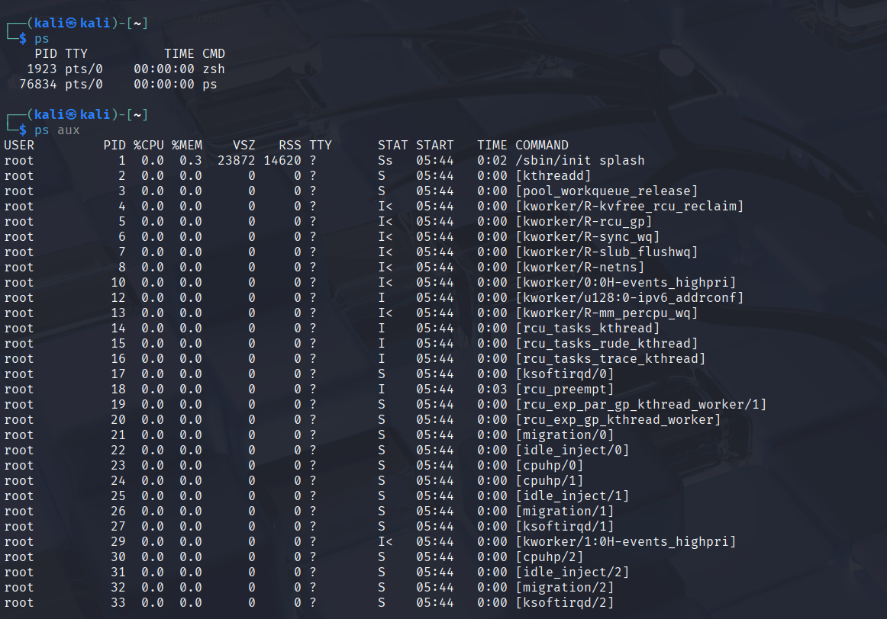

#### 3. Real-Time System Monitoring
```bash
top
```
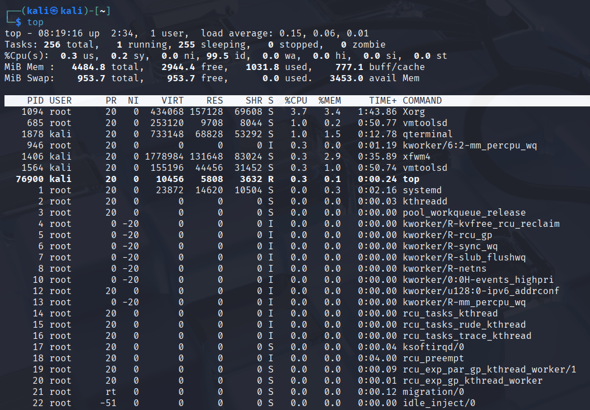

#### 4. Interactive Process Viewer
```bash
htop
```
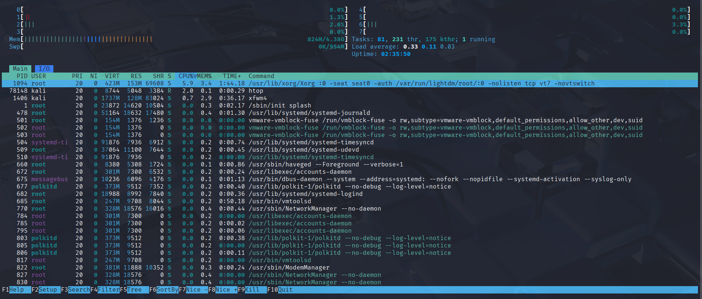
---

## Questions and Answers

### 1. What is a Process?

A process is an instance of a program that is currently running on the operating system.

### 2. What is a PID?

PID (Process ID) is a unique numerical identifier assigned by the operating system to each running process. It is used to manage and track processes.

### 3. Which Process is Consuming the Most CPU?

- Process Name: `root`
- PID: `1094`
- CPU Usage: `3.7%`

### 4. Which Process is Consuming the Most Memory?

- Process Name: `root`
- PID: `1094`
- Memory Usage: `3.4%`

---

## Part B: Process Management

### Step 1: Start a Background Process

```bash
sleep 300
```


### Step 2: Find the Process

```bash
ps aux | grep sleep
```

### Output

```bash
kali       84934  0.0  0.0   5580  2020 pts/0    S+   08:33   0:00 sleep 300
kali       85065  0.0  0.0   6528  2236 pts/1    S+   08:34   0:00 grep --color=auto sleep
```

### Step 3: Terminate the Process

```bash
kill 84934
```
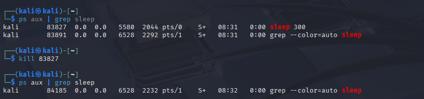

### Step 4: Forcefully Terminate the Process

```bash
kill -9 84934
```


---

## Process Management Summary

| Item | Result |
|--------|--------|
| PID Found | Yes |
| Command Used | `ps aux \| grep sleep` |
| Status | Process Terminated Successfully |

---

# Part C: System Monitoring

## Commands Used

### 1. Check Memory Information

```bash
free -h
```

### 2. Check Disk Usage

```bash
df -h
```

### 3. Check System Uptime

```bash
uptime
```

### 4. Check Kernel Information

```bash
uname -a
```
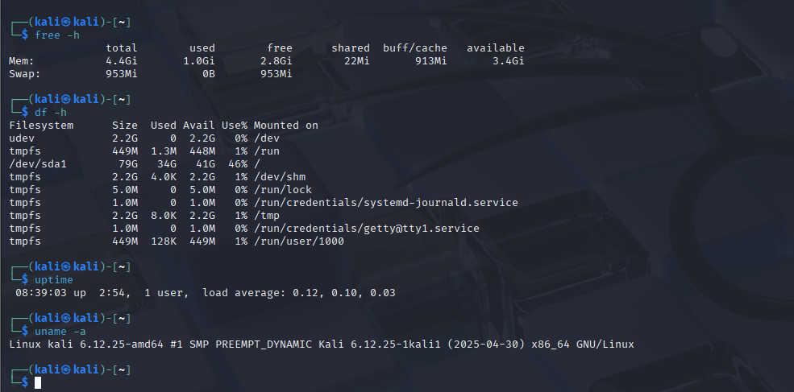
---

## Recorded Information

### Memory Information

| Parameter     | Value   |
| ------------- | ------- |
| Total RAM     | 4.4 GiB |
| Available RAM | 3.4 GiB |
| Used RAM      | 1.0 GiB |
| Free RAM      | 2.8 GiB |
| Swap Memory   | 953 MiB |

### Disk Usage

| Filesystem | Size  | Used  | Available | Use% |
| ---------- | ----- | ----- | --------- | ---- |
| /dev/sda1  | 79 GB | 34 GB | 41 GB     | 46%  |

### System Uptime

| Parameter     | Value              |
| ------------- | ------------------ |
| System Uptime | 2 hours 54 minutes |
| Active Users  | 1                  |
| Load Average  | 0.12, 0.10, 0.03   |

### Kernel Information

| Parameter        | Value           |
| ---------------- | --------------- |
| Operating System | Kali Linux      |
| Kernel Version   | 6.12.25-amd64   |
| Architecture     | x86_64 (64-bit) |

---

# System Summary Report

The system is running Kali Linux with kernel version 6.12.25-amd64 on a 64-bit architecture. The machine has a total of 4.4 GiB of RAM, out of which 3.4 GiB is currently available for use. Swap memory of 953 MiB is configured and currently unused.
The primary storage partition (/dev/sda1) has a total capacity of 79 GB, with 34 GB used and 41 GB available, resulting in 46% disk utilization.
The system has been running continuously for 2 hours and 54 minutes with one active user. The load average values (0.12, 0.10, 0.03) indicate that the system is under a very light workload and is performing efficiently.
Overall, the system resources are healthy, with sufficient available memory, moderate disk usage, and low processor load.

---

## Part D: Service Monitoring

### Commands Used

#### 1. Check SSH Service Status

```bash
systemctl status ssh
```
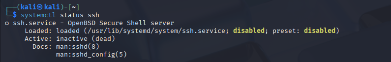

#### 2. Check NetworkManager Service Status

```bash
systemctl status NetworkManager
```
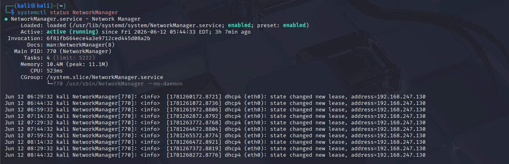

---

## Questions and Answers

### 1. What is a Service?

A service is a program or process that runs in the background to perform specific tasks and provide functionality to the operating system or users. Services usually start automatically when the system boots and continue running without direct user interaction.

### 2. Why are Services Important?

Services are important because they provide essential system functions such as networking, printing, database management, web hosting, and system logging. They ensure that critical tasks are available whenever needed and help maintain the smooth operation of the system.

### 3. How Can a Stopped Service Affect a System?

If a service stops running, the functionality it provides becomes unavailable. This can lead to several issues:

- Loss of network connectivity if a network service stops.
- Inability to access websites if a web server service stops.
- Failure of applications that depend on the service.
- Reduced system performance or stability.
- Interruptions in user access and system operations.

---

## Part E: Shell Scripting

### Script Code

```bash
#!/bin/bash

echo "   System Information Report"

echo "User: $(whoami)"
echo "Hostname: $(hostname)"
echo "Date & Time: $(date)"
echo "Current Directory: $(pwd)"

echo ""
echo "Memory Usage:"
free -h

echo ""
echo "Disk Usage:"
df -h /

echo ""
echo "Report Generated Successfully"
```

---

## Script Explanation

### Display Current User

```bash
whoami
```

Shows the username of the currently logged-in user.

### Display Hostname

```bash
hostname
```

Shows the system hostname.

### Display Current Date and Time

```bash
date
```

Shows the current system date and time.

### Display Current Directory

```bash
pwd
```

Shows the present working directory.

### Display Memory Usage

```bash
free -h
```

Displays memory usage in a human-readable format.

### Display Disk Usage

```bash
df -h /
```

Displays disk space usage for the root filesystem.

---

## Script Output

```text
System Information Report

User: kali
Hostname: kali
Date & Time: Fri Jun 13 08:45:12 IST 2026
Current Directory: /home/kali

Memory Usage:
<output of free -h>

Disk Usage:
<output of df -h />

Report Generated Successfully
```
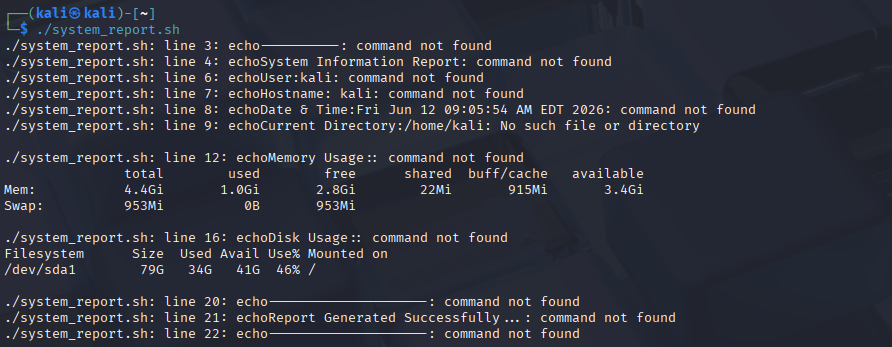

---

# Part F: Security Monitoring Challenge

## 1. netstat

### Purpose

`netstat` is a command-line utility used to display information about network connections, routing tables, network interfaces, and network statistics. It helps administrators understand how the system is communicating with other devices over a network.

Although `netstat` is considered a legacy tool and is gradually being replaced by `ss`, it is still widely used for troubleshooting and security monitoring.

### Example Output

```text
Proto Recv-Q Send-Q Local Address   Foreign Address State   PID/Program Name
tcp   0      0      0.0.0.0:22      0.0.0.0:*       LISTEN  712/sshd
tcp   0      0      127.0.0.1:631   0.0.0.0:*       LISTEN  567/cupsd
udp   0      0      0.0.0.0:68      0.0.0.0:*               501/dhclient
```

### Security Use Cases

- Detect open ports
- Detect backdoors
- Identify active connections
- Incident response and troubleshooting

---

## 2. ss (Socket Statistics)

### Purpose

`ss` is a modern replacement for `netstat`.

It retrieves information directly from the Linux kernel and is:

- Faster
- More efficient
- More detailed than `netstat`

### Example Command

```bash
ss
```

### Security Use Cases

- Detect unauthorized services
- Monitor malware activity
- Detect reverse shells
- Real-time network monitoring

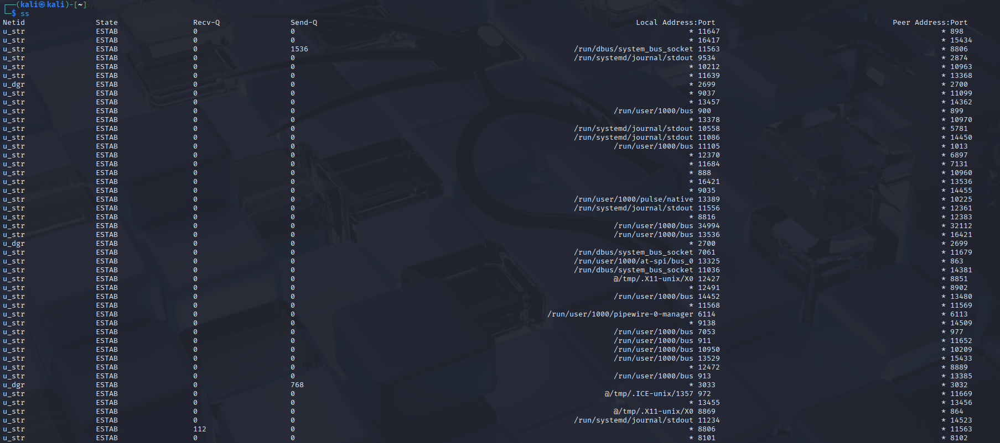
---


## 3. who

### Purpose

The `who` command displays information about users currently logged into the system.

It reads information from the `/var/run/utmp` file.

### Example Output

```bash
$ who
kali     seat0        2026-06-13 00:56 (:0)
```

### Security Use Cases

- Detect unauthorized users
- Detect remote logins
- Security auditing
- Monitor active sessions

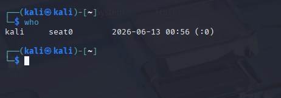
---

## 4. w

### Purpose

The `w` command provides detailed information about logged-in users and what they are currently doing.

Unlike `who`, it also displays:

- Current processes
- CPU usage
- Idle time
- System load

### Example Output

```bash
$ w
01:32:21 up 36 min, 1 user, load average: 0.02, 0.02, 0.00

USER   TTY   FROM   LOGIN@   IDLE   JCPU   PCPU   WHAT
kali         -      00:56            0.00s  0.01s lightdm --session-child
```

### Security Use Cases

- Monitor user activity
- Detect suspicious commands
- Insider threat detection
- Incident investigation

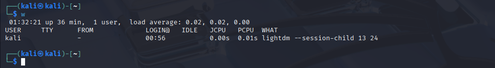

---

## 5. last

### Purpose

The `last` command displays login history by reading the `/var/log/wtmp` file.

It provides information about:

- User logins
- Logout times
- Session duration
- System reboots

### Example Command

```bash
last
```

### Security Use Cases

- Detect unauthorized access
- Investigate brute-force attempts
- Perform forensic analysis
- Track system reboots and login history

---

## Security Monitoring Summary

| Command | Purpose | Security Benefit |
|----------|----------|------------------|
| `netstat` | View network connections and ports | Detect open ports and suspicious connections |
| `ss` | Modern socket statistics tool | Monitor network activity efficiently |
| `who` | Show logged-in users | Detect unauthorized users |
| `w` | Show user activity | Monitor active sessions and commands |
| `last` | Display login history | Audit access and investigate incidents |

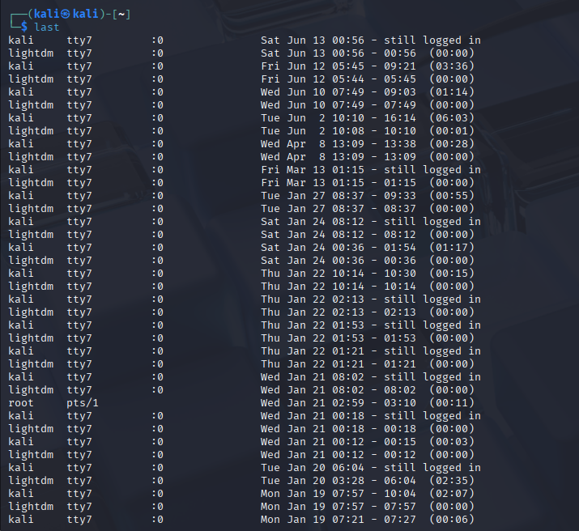

---

---

# Part G: Mini SOC Activity

## 1. How Would You Identify Resource-Heavy Processes?

### Answer

The first step is to check the system's resource usage. I would use commands such as:

```bash
top
```

or

```bash
ps aux --sort=-%cpu
```

to identify processes consuming the most CPU resources.

To identify processes using excessive memory, I would use:

```bash
ps aux --sort=-%mem
```

I would also use:

```bash
free -h
```

to check overall memory usage and:

```bash
uptime
```

to view system load averages.

By analyzing these outputs, I can determine which process is responsible for high CPU, memory, or system load and investigate it further.

---

## 2. How Would You Determine Whether a Process Is Suspicious?

### Answer

Finding a resource-heavy process does not automatically mean it is malicious. I would gather additional information before making a judgment.

First, I would check the process details:

```bash
ps -p PID -f
```

This helps identify the process name, owner, and parent process.

Next, I would verify whether the process belongs to a legitimate application or system service. Processes with unusual names, random character strings, or unknown origins may require further investigation.

I would also inspect network activity using:

```bash
ss -tulnp
```

or

```bash
netstat -tulnp
```

to determine whether the process is communicating with external systems.

Additionally, I would check which users are logged in:

```bash
who
```

and

```bash
w
```

to identify whether an authorized user started the process.

### Indicators of a Suspicious Process

- Extremely high CPU or memory usage without a clear reason
- Unknown process names
- Unexpected network connections
- Processes running from unusual directories
- Unauthorized user activity
- Unexpected services listening on network ports

---

## 3. What Information Would You Collect Before Terminating a Process?

### Answer

Before terminating any process, I would collect as much information as possible because killing the wrong process could disrupt important services or affect system stability.

### Process Information

- Process Name
- Process ID (PID)
- User Running the Process
- Parent Process ID (PPID)
- CPU Usage
- Memory Usage

Commands:

```bash
ps aux | grep PID
```

or

```bash
ps -fp PID
```

### Network Information

- Active network connections
- Open ports
- Remote IP addresses

Commands:

```bash
ss -tulnp
```

or

```bash
netstat -tulnp
```

### User Activity

- Logged-in users
- Current user sessions

Commands:

```bash
who
```

```bash
w
```

### System Status

- Memory utilization
- System load
- Disk usage

Commands:

```bash
free -h
```

```bash
uptime
```

```bash
df -h
```

After collecting this information and confirming that the process is unnecessary, malicious, or causing system issues, I would terminate it using:

```bash
kill PID
```

If the process does not stop normally, I would use:

```bash
kill -9 PID
```

---

## SOC Investigation Workflow

1. Identify high CPU or memory usage processes.
2. Gather process details and ownership information.
3. Check network activity and open ports.
4. Verify logged-in users and active sessions.
5. Review system resource utilization.
6. Determine whether the process is legitimate or suspicious.
7. Document findings and evidence.
8. Terminate the process if necessary.
9. Continue monitoring the system for unusual activity.

---
## Conclusion

This task provided hands-on experience with Linux process management, system monitoring, service monitoring, shell scripting, and basic security operations. Various commands such as `ps`, `top`, `htop`, `systemctl`, `netstat`, `ss`, `who`, `w`, and `last` were used to monitor system resources, manage processes, inspect services, and analyze user and network activity.
A shell script was also developed to automate the collection of system information, demonstrating the power of Bash scripting for routine administrative tasks. Additionally, security monitoring techniques were explored through a Mini SOC activity, where process investigation, network analysis, and incident response procedures were performed.
Overall, this task strengthened practical Linux administration skills and provided a foundational understanding of system monitoring, troubleshooting, automation, and security monitoring, which are essential for system administrators, DevOps engineers, and cybersecurity professionals.