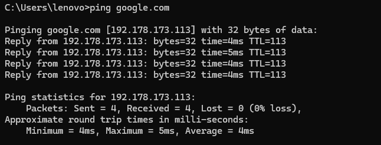
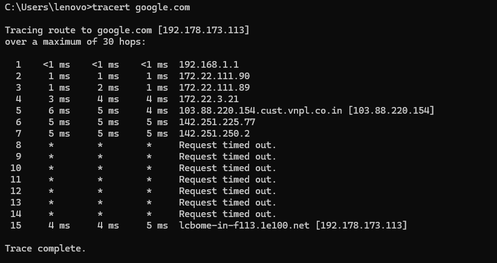

# Networking Task 01 Report

**Date:** June 2, 2026
**Intern:** Deven Sonawane

---

# Part A: Network Information

| Parameter       | Value                                      |
| --------------- | ------------------------------------------ |
| Hostname        | DESKTOP-R54DROC                            |
| IPv4 Address    | 192.168.56.1                               |
| MAC Address     | 0A-00-27-00-00-04                          |
| Default Gateway | Not Available                              |
| DNS Server      | 192.168.1.1 (Shown as Unknown in nslookup) |

## Command Outputs

### ipconfig /all


### nslookup


---

# Part B: Basic Networking Concepts

## Q1. What is an IP Address?

An IP (Internet Protocol) Address is a unique numerical identifier assigned to a device on a network. It enables devices to communicate and exchange data over a network.

### Types of IP Addresses

#### IPv4

* Length: 32 bits
* Format: Four decimal numbers separated by dots (.)
* Example: `192.168.0.1`

#### IPv6

* Length: 128 bits
* Format: Hexadecimal numbers separated by colons (:)
* Example: `2001:0db8:85a3:0000:0000:8a2e:0370:7334`

---

## Q2. What is a MAC Address?

MAC (Media Access Control) Address is a unique hardware identifier assigned to a Network Interface Card (NIC) by the manufacturer.

### Characteristics

* Length: 48 bits
* Format: Hexadecimal
* Example: `00:1A:2B:3C:4D:5E`
* Used for communication within a local network (LAN)

---

## Q3. What is a Default Gateway?

A Default Gateway is a networking device (usually a router) that acts as the exit point from a local network.

### Functions

* Routes traffic outside the local network
* Connects local devices to the Internet
* Usually represented by the router's IP address

Example:

```text
Device → Router (Gateway) → Internet
```

---

## Q4. What is DNS?

DNS (Domain Name System) converts domain names into IP addresses.

Example:

```text
google.com → 142.250.183.14
```

### Importance of DNS

* Makes websites easier to access
* Eliminates the need to remember IP addresses
* Translates human-readable names into machine-readable addresses

---

## Q5. Difference Between Public IP and Private IP

### Public IP Address

* Accessible over the Internet
* Assigned by ISP
* Globally unique
* Used for WAN communication
* Visible to external networks

Examples:

* 8.8.8.8
* 49.36.120.15

### Private IP Address

* Used within local networks
* Assigned by router or DHCP server
* Not directly accessible from the Internet
* Used for LAN communication
* Visible only inside the local network

Examples:

* 192.168.1.10
* 10.0.0.5

| Feature       | Public IP | Private IP    |
| ------------- | --------- | ------------- |
| Scope         | Internet  | Local Network |
| Assigned By   | ISP       | Router/DHCP   |
| Accessibility | Public    | Internal      |
| Communication | WAN       | LAN           |
| Example       | 8.8.8.8   | 192.168.1.10  |

---

# Part C: Basic Network Diagram

## Network Connection Diagram


---

# Part D: Network Connectivity Test

## 1. Was the ping successful?

**Answer:** Yes.

The ping command successfully received replies from the destination server, confirming network connectivity.



---

## 2. How many hops were shown?

**Answer:** 15 hops.

The traceroute reached Google at Hop 15.

```text
15    4 ms    4 ms    5 ms    lcbome-in-f113.1e100.net [192.178.173.113]
```

### Traceroute Output



### Observation

| Hop  | Description                     |
| ---- | ------------------------------- |
| 1    | Local Router (192.168.1.1)      |
| 2-7  | ISP Network Routers             |
| 8-14 | Request Timed Out               |
| 15   | Google Server (192.178.173.113) |

### Conclusion

The destination server was successfully reached after 15 hops.

---

## 3. What is the purpose of traceroute?

Traceroute (tracert in Windows) is a network diagnostic tool used to identify the route taken by packets from a source device to a destination server.

### Purposes of Traceroute

* Displays the route followed by packets
* Measures network latency
* Identifies network issues
* Troubleshoots connectivity problems
* Analyzes network performance

### Command Used

```cmd
tracert google.com
```

### Conclusion

Traceroute helps visualize packet paths and identify delays or failures at specific points within a network.

---

# Summary

This task involved collecting network configuration details, understanding basic networking concepts, creating a network diagram, and testing network connectivity using Ping and Traceroute commands. The results confirmed successful network communication and provided insight into how devices communicate across local and wide-area networks.
