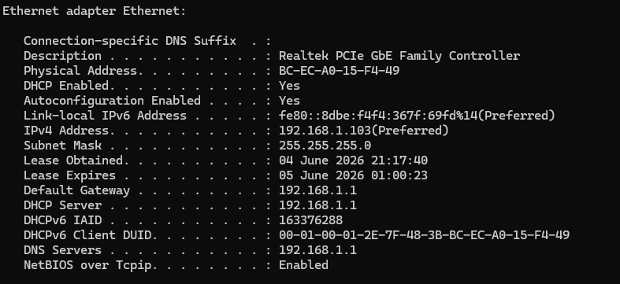
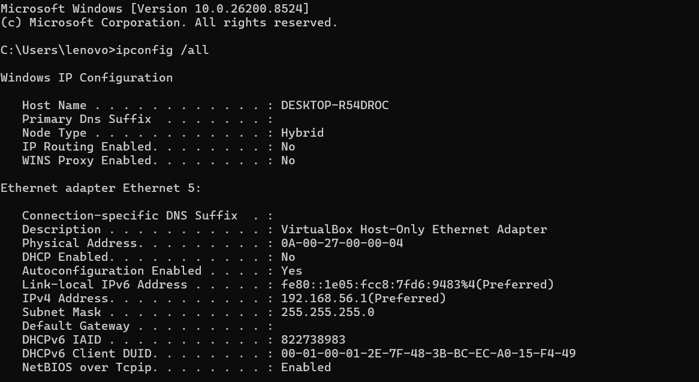
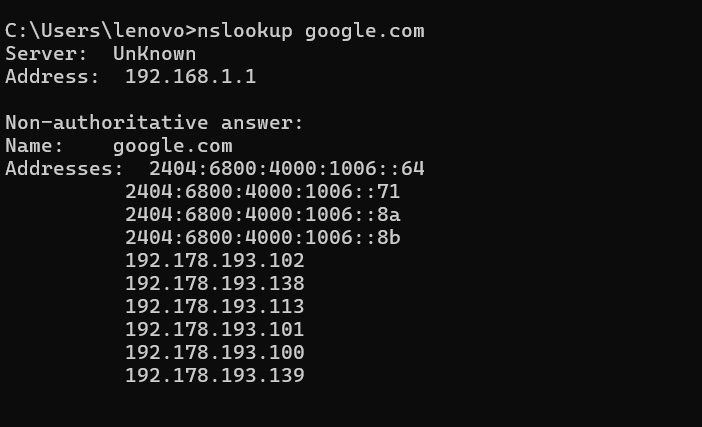
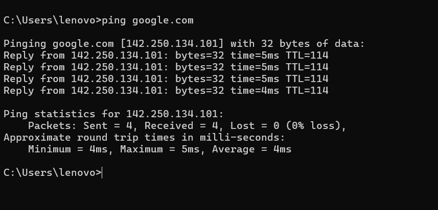

# Networking Task 02: Network Devices & IP Addressing

---

# Part A: Network Devices Research

## 1. Router

A router is a networking device that forwards data packets between different computer networks. It connects multiple packet-switched networks or subnetworks, managing traffic by directing packets to their intended IP addresses. Routers allow multiple devices to share an Internet connection efficiently.

### How It Works
- A router receives data packets from devices on a network.
- It examines the destination IP address of each packet.
- Using its routing table, it determines the best path for the packet.
- The router forwards the packet to the appropriate network.
- It also performs Network Address Translation (NAT), allowing multiple devices to share a single public IP address.

### Real-World Usage
- Home Wi-Fi routers connect laptops, smartphones, and smart TVs to the Internet.
- Offices use routers to connect internal networks with external networks.
- Internet Service Providers (ISPs) use high-performance routers to route traffic across the Internet.

### Example
When you browse a website from your laptop, the router sends your request to the Internet and returns the website data back to your device.

---

## 2. Switch

A switch is a network device that is used to segment networks into different subnetworks called subnets or LAN segments. It is responsible for filtering and forwarding packets between LAN segments based on MAC addresses.

### How It Works
- Each device connected to a switch has a unique MAC address.
- The switch learns and stores MAC addresses in its MAC address table.
- When data arrives, the switch checks the destination MAC address.
- It sends the data only to the intended device instead of broadcasting it to all devices.

### Real-World Usage
- Offices connect computers, printers, and servers through switches.
- Schools and colleges use switches to connect laboratory computers.
- Data centers use switches to interconnect thousands of servers.

### Example
In a computer lab with 50 computers, a switch ensures that a file sent from one computer reaches only the intended destination computer.

---

## 3. Hub

A hub is a hardware device used at the Physical Layer to connect multiple devices in a network. Unlike a switch, a hub cannot identify the destination of a packet, so it broadcasts the data to all connected devices.

### How It Works
- A hub receives data from one device.
- It broadcasts the data to every connected device.
- All devices receive the data, but only the intended device processes it.
- Unlike switches, hubs do not understand MAC addresses.

### Real-World Usage
- Previously used in small networks.
- Mostly replaced by switches due to better efficiency.

### Example
If Computer A sends data to Computer B through a hub, all computers connected to the hub receive the data, even though only Computer B uses it.

---

## 4. Access Point

A Wireless Access Point (WAP) is a networking device that allows wireless devices to connect to a wired network. It is commonly used to create a Wireless Local Area Network (WLAN).

### How It Works
- The access point connects to a wired network using an Ethernet cable.
- It broadcasts wireless signals.
- Wireless devices such as smartphones and laptops connect to the access point.
- Data from wireless devices is forwarded to the wired network and vice versa.

### Real-World Usage
- Offices use access points to provide Wi-Fi throughout buildings.
- Universities install multiple access points to cover large campuses.
- Shopping malls and airports provide public Wi-Fi.

### Example
When you connect your smartphone to office Wi-Fi, the access point receives and forwards your data to the company network.

---

## 5. Firewall

A firewall is a network security system available as hardware or software that monitors and controls incoming and outgoing traffic based on predefined security rules.

### How It Works
- Examines network traffic entering or leaving the network.
- Compares traffic against security policies.
- Allows safe traffic and blocks suspicious or unauthorized traffic.
- Protects systems from hackers, malware, and cyberattacks.

### Real-World Usage
- Businesses use firewalls to protect corporate networks.
- Home routers often include built-in firewalls.
- Banks and government organizations use advanced firewalls.

### Example
A firewall can block unauthorized users from accessing a company's internal servers through the Internet.

---

## 6. Modem

Modem stands for **Modulator/Demodulator**. It is a networking device used to connect devices on a network to the Internet by converting signals between analog and digital forms.

### How It Works
- Converts digital signals from computers into analog signals for transmission.
- Converts incoming analog signals back into digital signals.
- Acts as a bridge between the ISP and the local network.

### Real-World Usage
- Every home broadband connection uses a modem.
- Businesses use modems to connect networks to the Internet.
- Fiber-optic Internet connections use Optical Network Terminals (ONTs).

### Example
When you subscribe to broadband Internet, the modem receives Internet signals from the ISP and passes them to your router.

---

# Part B: IP Address Classification

| IP Address | Type | Reason |
|------------|------|---------|
| 192.168.1.10 | Private | Falls within 192.168.0.0 – 192.168.255.255 |
| 10.0.0.5 | Private | Falls within 10.0.0.0 – 10.255.255.255 |
| 172.16.5.20 | Private | Falls within 172.16.0.0 – 172.31.255.255 |
| 8.8.8.8 | Public | Does not belong to any private range |
| 1.1.1.1 | Public | Does not belong to any private range |
| 192.168.100.1 | Private | Falls within 192.168.0.0 – 192.168.255.255 |

---

# Part C: Understanding Your Network

## Network Information

| Parameter | Value |
|------------|---------|
| IPv4 Address | 192.168.1.103 |
| Default Gateway | 192.168.1.1 |
| DNS Server | 192.168.1.1 |



### Q1. Which IP range does your device belong to?

**Answer:**  
My device belongs to the range **192.168.0.0 – 192.168.255.255**.

### Q2. Is it Public or Private?

**Answer:**  
It is a **Private IP Address**.

### Q3. What role does your router play in your network?

**Answer:**  
The router acts as the gateway between my local network and the Internet. It assigns IP addresses, routes data packets, performs Network Address Translation (NAT), and enables devices on the network to communicate with external networks.

### Q4. What would happen if the DNS server stopped working?

**Answer:**
1. The browser cannot translate domain names.
2. Websites cannot be accessed using domain names.
3. Users would need to enter IP addresses manually.
4. Other Internet services may fail to locate servers.

---

# Part D: Network Communication Flow


## Explanation

### 1. Your Device
When I type **www.google.com** in my web browser and press Enter, my computer starts a request to open Google's website. At this point, it only knows the website name, not the actual IP address of Google's server.

### 2. Router
The request is sent to my router (**192.168.1.1**). The router acts as a bridge between my home network and the Internet. It forwards my request to the correct destination.

### 3. DNS Server
The DNS server helps find the IP address of **www.google.com**. It works like a phonebook by converting the website name into a numerical IP address that computers can understand.

### 4. Google Server
Once the IP address is found, the request reaches Google's server. The server processes the request and prepares the Google webpage, including text, images, and other content.

### 5. Response Back to Your Device
Google's server sends the webpage data back through the Internet to my router. The router then forwards the data to my computer, and the Google homepage appears in my web browser.

---

# Part E: Practical Command Exercise

## Commands Used

```cmd
ipconfig /all
nslookup google.com
ping google.com
```
## 1. ipconfig /all


## 2. nslookup google.com


## 3. ping google.com


## Questions

### Q1. What IP address did DNS return for Google?

#### IPv4 Addresses

- 192.178.193.102
- 192.178.193.138
- 192.178.193.113
- 192.178.193.101
- 192.178.193.100
- 192.178.193.139

#### IPv6 Addresses

- 2404:6800:4000:1006::64
- 2404:6800:4000:1006::71
- 2404:6800:4000:1006::8a
- 2404:6800:4000:1006::8b

### Q2. Was the ping successful?

**Answer:**  
Yes, the ping was successful.

### Q3. Why is DNS important before communication begins?

**Answer:**  
DNS (Domain Name System) is important because it converts a website's name into an IP address that computers can understand. Before communication begins, the DNS server finds the correct IP address of the website so that the device can communicate with the correct server.

---

# Conclusion

This task helped in understanding the working of network devices, IP address classification, network communication flow, and the importance of DNS in Internet communication. Practical commands such as `ipconfig`, `nslookup`, and `ping` were used to analyze and understand real network configurations.